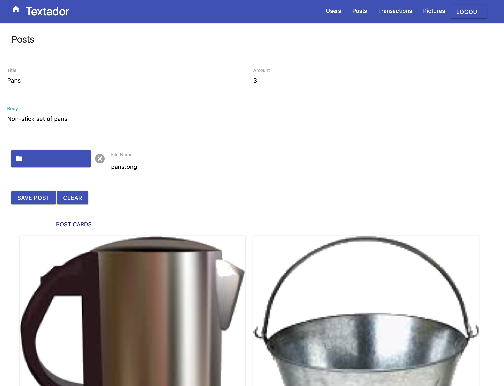
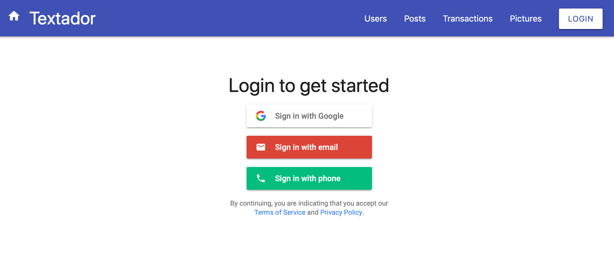
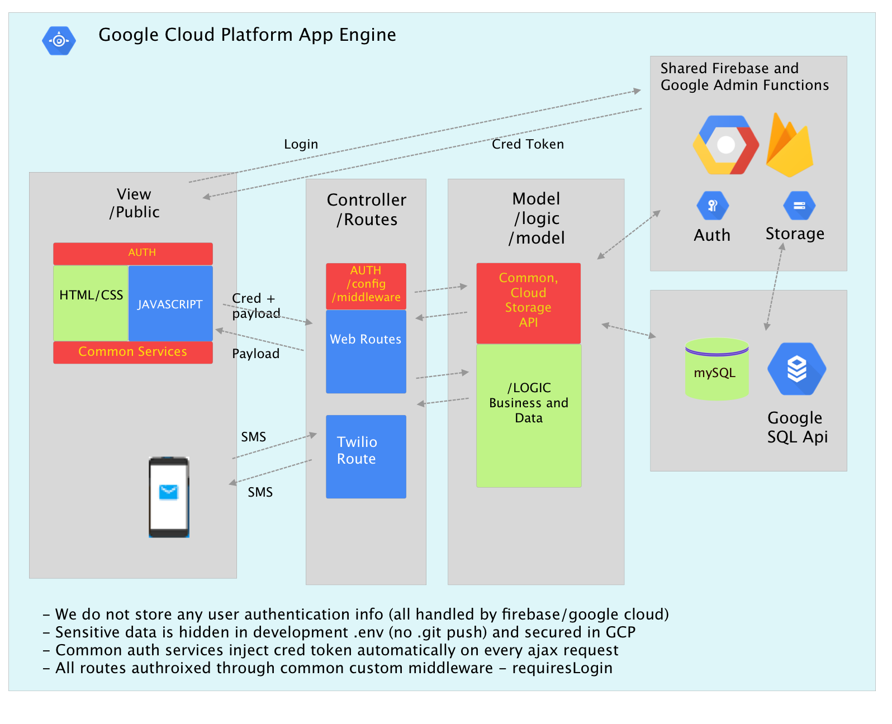

# Textador - Content Management System using web and SMS (with twilio)

## Overview

Textador is a content management system for eCommerce and SMS transactions.  It is a full stack web application, but it's special purpose is to allow commerce for people that do not have access to the internet - only text messages.  There are a huge number of areas in the world where folks do not have internet access but have SMS.  It allows a user / _banker_ to host a site that manages buying and selling various items that users post.  This _banker_ is called a **Textador**.  Photos, Posts and eCommerce Transactions can be managed via the full stack web application.  The Textador is the middleman to facilitate access to folks **without** internet access.  Theese folks participate buying and selling through their cell phones using standard SMS through the Textador's account/system number.  `subscribers` can view, and buy items using standard text messages on their cell phones.  The application is fully secured using firebase / google OAuth 2.0 authentication services.

**NOTE**:  The app is fully deployed to the gooogle could platform.  To utilie/test the Textador's SMS portions requires a bit of Twilio setup as you need a **system** phone number to gain access to some of he functions only availablke to Textadors.

## Team

* Luke Fuller - Posts Full Stack
* Remy Remington- User Full Stack
* Paul Linck - Photos, Architecture and Common Logic
* Patrick Herald - Twilio and SMS

### Deployment

This is deployed to **Google Cloud Platform** (not Heroku).  It provides several huge advantages especially as it relates to security and hiding keys and credentials.  When app is running in test mode, sensitive data is stored in hidden files on developers local machine. When depoloyed to google cloud platform, the services keys, credentials etc are automatically protected and accessed inside the google cloud platform App engine.

## Links

* [Live Google Cloud Platform Site](https://project2twiliocms.appspot.com/)
* [GitHub for this](https://github.com/patrickherold/twilioCMS)

## Technologies Used

* [x] HTML/CSS/Javascript/JQuery
* [x] Materialize
* [x] Sequelize,SQL, mySQL
* [x] Google Cloud Platform (App Engine, SQL DB, SQL Admin Services, Google Functions)
* [x] Firebase/Google Admin - Authentication and Authorization
* [x] Firebase/Google Cloud Storage - Multimedia Storage Buckets
* [x] Twilio (for sending and receiving text messages)
* [x] Node.js, Express

## Screenshots

## Architecture

### Model View Controller (with lightweight controller routing to business and data logic)

* Architecture Diagram below:
  

* Views / Client - `/public` HTML/CSS/JS and SMS
  * Firebase Authentication and Authorization - Secure credential token passed to sever for server auth
  * Materialize JS and CSS
  * Twilio used for SMS clients

* Controllers - `/routes` - HTML and Twilio routes
  * Custom Authorization Middleware using firebase/google cloud services (using secure google service account keys)
    * Authorization Congic and logic securely stored in `/config`
  * Application routes to bve traffic for service access - fairly thin logic here

* SharedBusiness Logic / Model Logic - `/logic`
  * Bulk of the application logic and data access resides here
  * Invoke thorough web routes and SMS routes - allows us to share logic no matter where request comes from
  * Utilizes Google Cloud Storage for Media Storage (images, videos etc)
    * Google Cloud Storage and Firebase Storage

* Model (Data) - `/models`, `/db`
  * Uses Sequelize for mySQL Data Access
